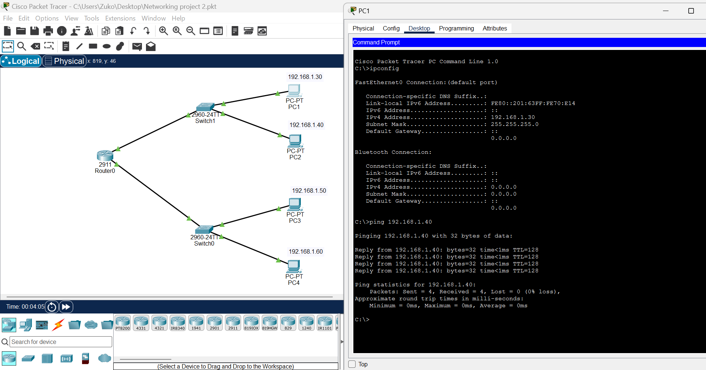
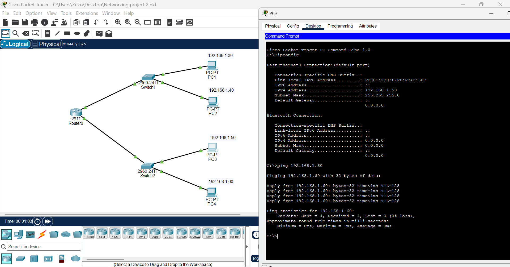
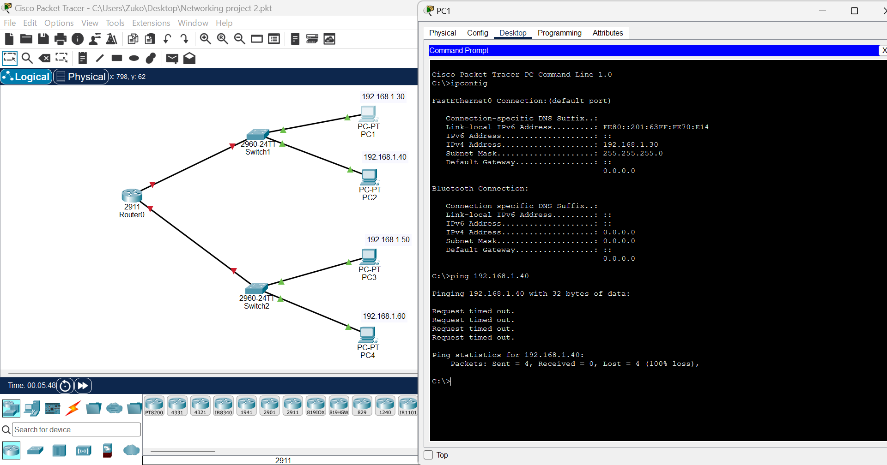

# Lab 02 — Routed Network

## Objective

Build and troubleshoot a basic network consisting of two LAN segments connected to a Cisco router.

## Topology

Network 1:

PC1 → Switch1 → Router

PC2 → Switch1 → Router

Network 2:

PC3 → Switch2 → Router

PC4 → Switch2 → Router

## Devices Used

- 1 × Cisco 2911 Router
- 2 × Cisco Catalyst 2960-24TT Switches
- 4 × PCs

## IP Addressing

| Device | IP Address | Subnet Mask |
|----------|-------------|--------------|
| PC1 | 192.168.1.30 | 255.255.255.0 |
| PC2 | 192.168.1.40 | 255.255.255.0 |
| PC3 | 192.168.1.50 | 255.255.255.0 |
| PC4 | 192.168.1.60 | 255.255.255.0 |

## Configuration

- Connected each pair of PCs to a switch.
- Connected both switches to a Cisco 2911 router.
- Configured IP addresses on all PCs.
- Configured router interfaces.
- Tested connectivity using the ping command.

## Initial Problem

Network communication failed because the router interfaces were disabled.

Results:

- PC1 could not communicate with PC2.
- PC3 could not communicate with PC4.
- Ping tests resulted in 100% packet loss.

## Troubleshooting

I investigated the network configuration and identified that the router interfaces connected to both switches were administratively down.

I resolved the issue by:

- Enabling the router interfaces.
- Verifying physical connectivity.
- Retesting communication between hosts.

## Verification

After enabling the router interfaces:

- PC1 successfully pinged PC2.
- PC3 successfully pinged PC4.
- Packet loss was reduced from 100% to 0%.

## What I Learned

- Router interfaces must be enabled before traffic can pass through the network.
- All networking devices must be configured correctly for communication to occur.
- The ping command can be used to test network connectivity.
- Troubleshooting requires checking both device configuration and interface status.

## Skills Demonstrated

- Cisco Packet Tracer
- Router configuration
- Switch connectivity
- IPv4 addressing
- Basic troubleshooting
- Interface verification
- Connectivity testing
## Evidence

### Working Network 1

### Working Network 2

### Troubleshooting Network 1

### Troubleshooting Network 2

