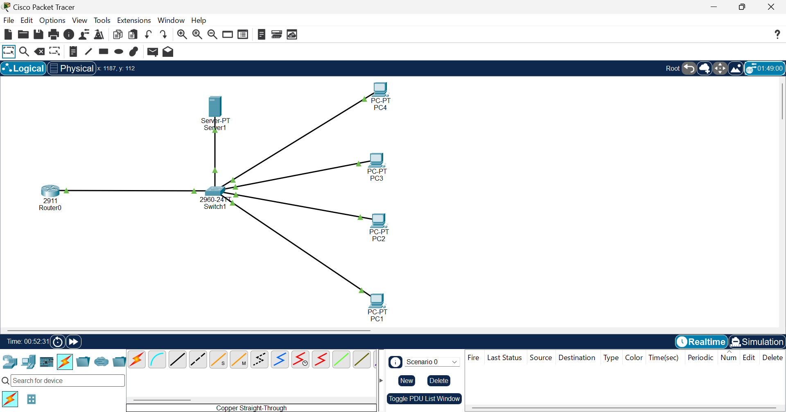
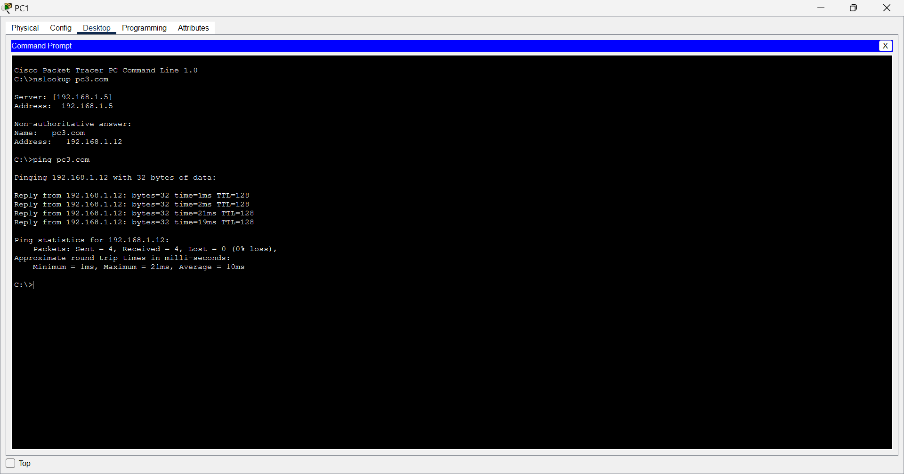
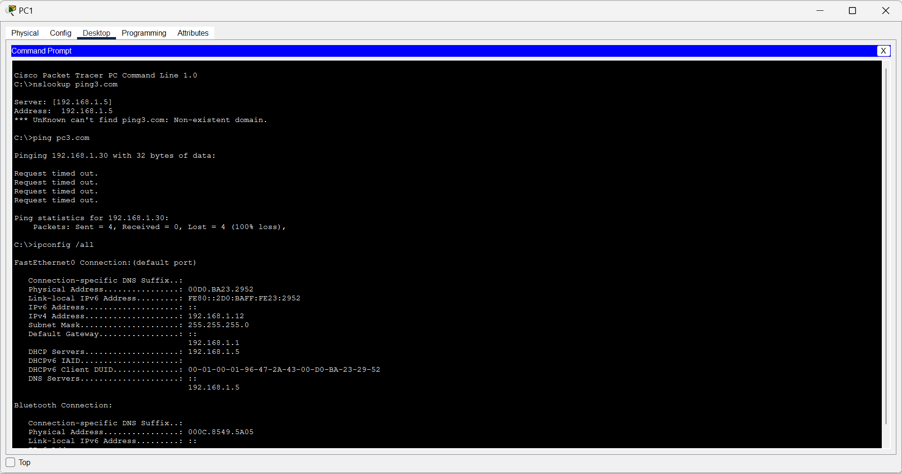

# Lab 03 — DHCP and DNS

## Objective

Build and troubleshoot a small network where client devices automatically receive their network configuration through DHCP and use DNS to resolve hostnames to IP addresses.

The purpose of this lab was to move from manually configured networking toward a more realistic network environment.

## Topology

```text
                         ┌── PC1
                         ├── PC2
Router ─── Switch ───────┼── PC3
                         ├── PC4
                         └── Server
```

## Devices Used

- 1 × Cisco 2911 Router
- 1 × Cisco Catalyst 2960-24TT Switch
- 4 × PCs
- 1 × Server

## Services

- DHCP
- DNS

## Configuration

The network was configured so that client devices could automatically obtain their IPv4 configuration through DHCP.

Clients received:

- IP address
- Subnet mask
- Default gateway
- DNS server information

The DHCP and DNS services were configured on the network server.

DNS records were configured for network hosts, allowing clients to resolve hostnames to IP addresses.

## DHCP Verification

The client configuration was verified using `ipconfig /all`.

The test showed that the client received its network configuration automatically, including:

- IPv4 address
- Subnet mask
- Default gateway
- DHCP server
- DNS server

## DNS Verification

DNS resolution was tested from a client using:

```text
nslookup pc3.com
```

The DNS server successfully resolved the hostname to its corresponding IP address.

Connectivity was then tested using:

```text
ping pc3.com
```

The ping completed successfully with 0% packet loss.

## Initial Problem

PC1 initially failed to communicate with PC3.

The problem was caused by:

- An incorrect default gateway configuration
- Incorrect DNS configuration

The DNS lookup also failed during troubleshooting.

## Troubleshooting

I investigated the client's network configuration and identified that the default gateway and DNS configuration were incorrect.

I corrected the default gateway and configured DNS properly.

After making the changes, I retested DNS resolution and network connectivity.

## Verification

After troubleshooting:

- DHCP successfully provided the client network configuration.
- DNS successfully resolved `pc3.com` to an IP address.
- PC1 successfully communicated with PC3.
- Ping testing showed 0% packet loss.

## What I Learned

I learned how DHCP can automatically provide network configuration to client devices instead of requiring each device to be configured manually.

I also learned how DNS translates hostnames into IP addresses and how incorrect gateway or DNS configuration can prevent network communication and hostname resolution.

## Skills Demonstrated

- DHCP configuration
- DNS configuration
- IPv4 addressing
- Automatic network configuration
- DNS hostname resolution
- `ipconfig /all`
- `nslookup`
- `ping`
- Network troubleshooting
- Cisco Packet Tracer
## Evidence

### Network Created



### Connection Established



### Troubleshooting


