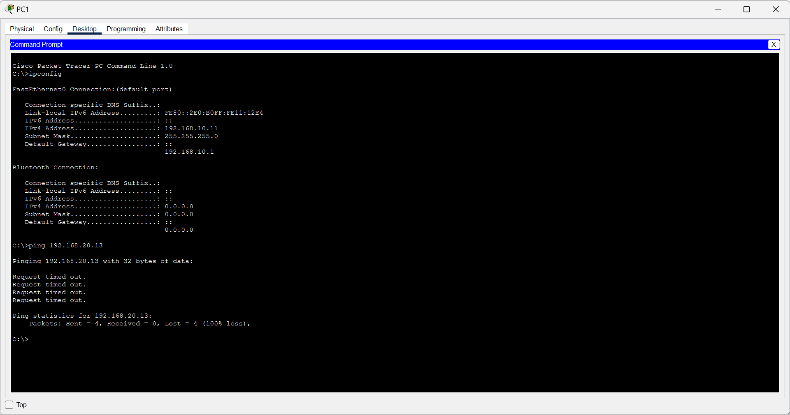

# Lab 05 — Inter-VLAN Routing

## Objective

Configure a network that allows devices belonging to different VLANs to communicate through a Cisco router.

## Topology

- 1 Cisco 2911 Router
- 1 Cisco 2960-24TT Switch
- 4 PCs
- 2 VLANs

The network uses VLAN segmentation and a trunk connection between the switch and router to allow communication between the different VLANs.

## Configuration

The network was configured with:

- VLAN 10
- VLAN 20
- IP addressing for devices in each VLAN
- Appropriate switch access ports
- A trunk connection between the switch and router
- Routing between VLANs
- Appropriate default gateways for the hosts

## Connectivity Testing

Connectivity was tested between hosts belonging to different VLANs to verify that inter-VLAN routing was functioning correctly.

The initial configuration contained errors that prevented communication between the VLANs.

## Problem Encountered

Hosts could not communicate because:

1. Switch port 24 was configured as an access port instead of a trunk port.
2. PC3 had an incorrectly configured IP address.

## Troubleshooting

I configured the correct trunk mode on switch port 24 and corrected the IP address configuration on PC3.

After making the corrections, I tested connectivity between the hosts again and confirmed that communication between the VLANs was working.

## What I Learned

I learned that small configuration errors in networking devices can prevent communication across an entire network. I also learned the importance of checking VLAN assignments, trunk configuration, IP addressing and default gateways when troubleshooting inter-VLAN connectivity.

## Evidence

### Network Topology

### Connection Established

### Troubleshooting

## Skills Demonstrated

- VLAN configuration
- IP addressing
- Switch port configuration
- Trunk configuration
- Inter-VLAN routing
- Default gateway configuration
- Connectivity testing
- Network troubleshooting
- Cisco Packet Tracer
